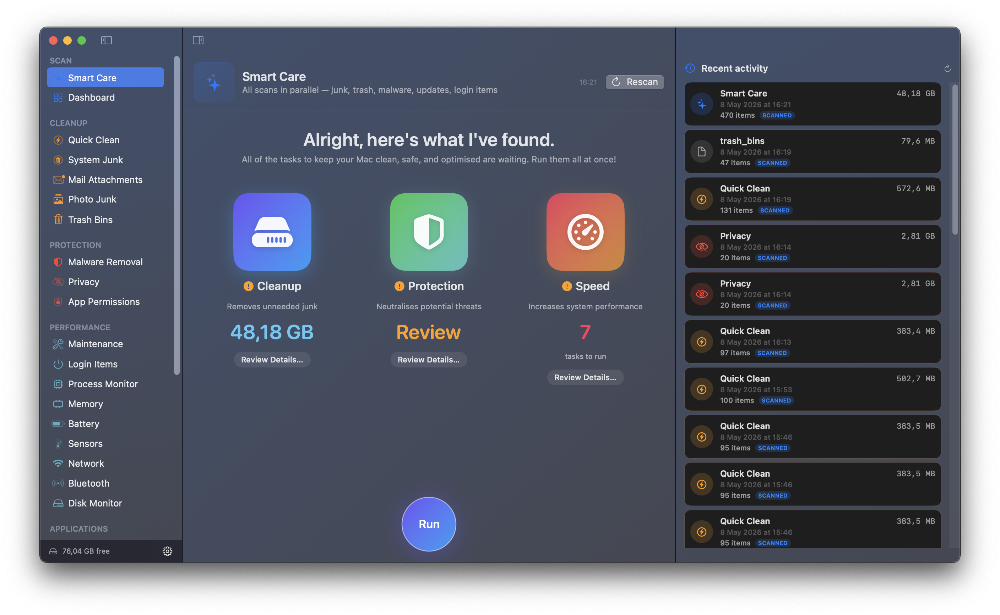

# SmartCleanner

Cross-platform cleaner + system monitor cho macOS và Windows.



## Repo layout

| Path | Mô tả |
|---|---|
| [`macOS/`](macOS/) | Bản gốc — SwiftUI + Swift 6, target macOS 13+. App scheme `MacCleaner`. Xem [`macOS/README.md`](macOS/README.md). |
| [`Windows/`](Windows/) | Bản port — WinUI 3 + .NET 8 (C#). Đang scaffold. Xem [`Windows/README.md`](Windows/README.md). |
| [`WINDOWS_PORT_PLAN.md`](WINDOWS_PORT_PLAN.md) | Kế hoạch port: feature inventory (giữ 23 / bỏ 8 module Mac-specific), Mac→Win API mapping, roadmap 7 phase. |

## Status

- **macOS** — đang dùng. 31 modules, single-user, ad-hoc signed.
- **Windows** — scaffolding bắt đầu, chưa có code.

Hai bản phát triển độc lập trong cùng repo để tiện cross-reference design system + thuật toán (`DirectionLockFilter`, `Duplicates` hash logic, perceptual photo hashing, v.v.).

## Quick start

### macOS

```bash
git clone https://github.com/dongnh311/SmartCleanner.git
cd SmartCleanner/macOS
xcodegen generate
xcodebuild -scheme MacCleaner -destination 'platform=macOS' build
```

Chi tiết: [`macOS/README.md`](macOS/README.md).

### Windows

Chưa start. Day-1 checklist trong [`WINDOWS_PORT_PLAN.md`](WINDOWS_PORT_PLAN.md#6-day-1-checklist-ngày-mai).

## License

Personal, not for distribution.
